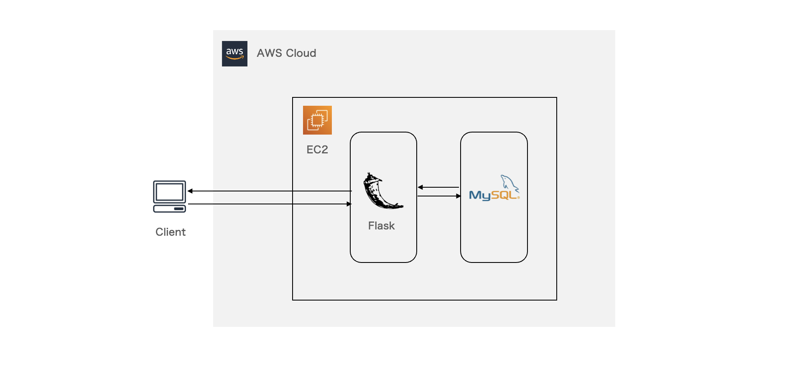
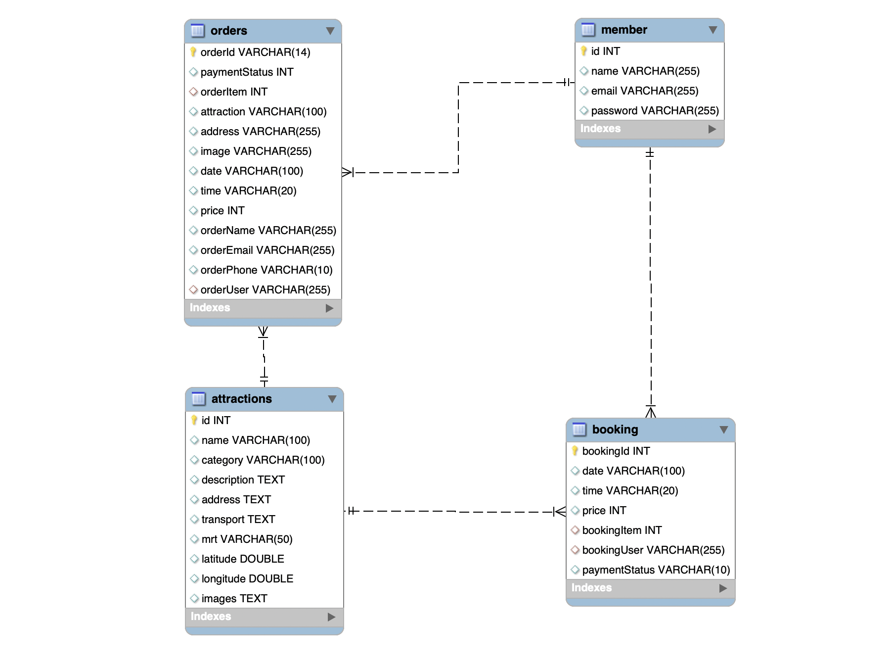

# Taipei-Day-Trip

  
  <h4>An e-commerce website which allow you to book a trip in Taipei city.</h4>
  <h5>My first project in <a href="https://training.pada-x.com/wehelp/">WeHelp</a>.</h5>

## Demo
#### Website URL : http://18.140.251.171:3000/
#### Test account
- Email: test@gmail.com
- Password: test

#### Test payment account
- Card Number: 4242-4242-4242-4242
- Expiration Date: 01/23
- CVV: 123
    
#### Book the attraction you like
- Users can find attractions with keywords.
- Users can book the trip after login.

  
#### Pay with credit card and check the order list
- Users can pay the trip with credit card.
- Users can check the order list in member page.
- Users can update password in member page. 

    
## Main Features
- Use Json Web Token to achieve authentication.
- Deploy the project to AWS EC2.
- Use TapPay as Third-Party Payment System.
- Build Member System with RESTful API.
- Build Infinite Scroller and Carousel Slider with Pure JavaScript.
- Create RWD layout using HTML and CSS Grid.

## System Architecture

    
## Database Schema

    
## Backend Technique
#### Environment
- Python/Flask

#### Database
- MySQL

#### Cloud Service (AWS)
- EC2

#### Version Control
- Git/GitHub

#### Third Party Library 
- TapPay SDK

#### Design Pattern
- MVC

## Front-End Technique
- HTML
- CSS
- JavaScript
- AJAX

## Contact
- Hsin-I Chang
- Email: nancy65018@gmail.com
